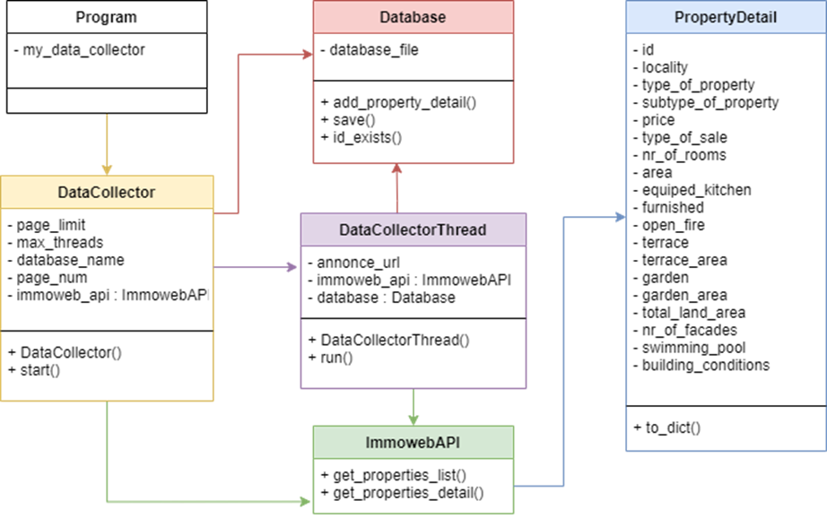
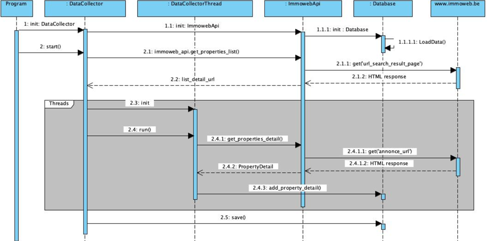

# Challenge collecting data @BeCode

## Purpose
Create a program in python using web scraping and python libraries to create a dataset of Belgian real estate listings.

## Objectives
- Be able to scrape a website
- Be able to build a dataset from scratch
- Be able to implement a strategy to collect as much data as possible

## Why
We are collecting this data for a fictitious real estate company who wants to create a machine learning model to make price predictions on real estate sales in Belgium.

## How
We have to scrape any belgian real estate agency website for information. 

We chose to scrape the data from the Immoweb website : https://www.immoweb.be/fr/recherche/maison-et-appartement/a-vendre?countries=BE&page={}&orderBy=relevance

The dataset(.csv) has to include the below columns:

    Locality
    Type of property (House/apartment)
    Subtype of property (Bungalow, Chalet, Mansion, ...)
    Price
    Type of sale (Exclusion of life sales)
    Number of rooms
    Fully equipped kitchen (Yes/No)
    Furnished (Yes/No)
    Open fire (Yes/No)
    Terrace (Yes/No)
        If yes: Area
    Garden (Yes/No)
        If yes: Area
    Livable surface area
    Surface area of the plot of land
    Number of facades
    Swimming pool (Yes/No)
    State of the building (New, to be renovated, ...)
    
## Must-have features
    [x] Data for all of Belgium.
    [x] Minimum of 10 000 inputs 
    [x] No empty row. If you are missing information, set the value to None.

## Class diagram
The class diagram represents the different classes that were created to be able to execute the program efficiently.

Within each class the variables and methods created and used are listed.

It also displays the connections between the different classes to allow their seemless interaction.

## Sequence diagram
The sequence diagram portrays the step by step process of the program. 

It shows how each method/variable from the different classes interact with each other to collect the data from the website
and store it in the .csv file.

## Possible improvements

    [] Improving the scraping time
    [] Check for other/better ways to store information in a database
    [] Change repetitive strings to code (e.g. Apartment Group -> AG)
    [] Scrape the 23 properties not able to retrieve from website due to a decoding error of JSON dictionary

## When

3 days to complete (18/11/2020 -- 22/11/2020)

## Team members - Contributors

* [Lise Amen](https://github.com/lise-amen)
* [Tina Folkers](https://github.com/tinafolkers)
* [Jérôme Coumont](https://github.com/jcoumont)
* [Jonathan Decleire](https://github.com/JonathanDecleire)
